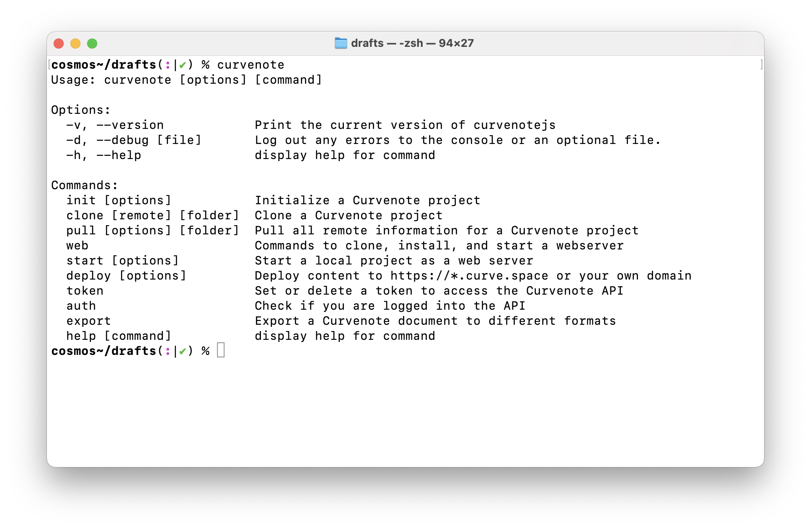
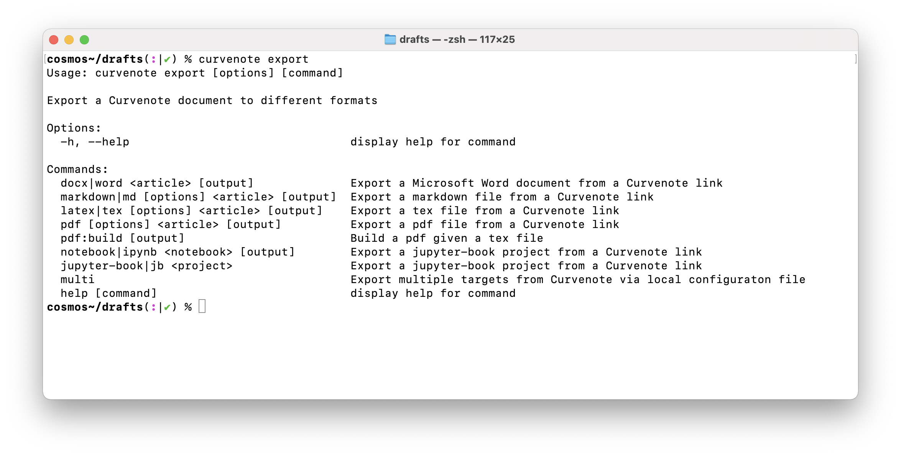

# Open Science Publishing on the Command Line

Over the past few months we've been busy building out a new open source command line interface (CLI) that sits top of our content translation schemas and can talk to the curvenote API. Why a CLI? Well command line interfaces (CLIs) can pack a lot of punch, with a lot of varied functionality made available in one small space. They can be used interactively as well as involed from scripts for automation.

CLIs can also be colorful and almost conversational making it easy for a wide range us users toi interact with them, and we've put a lot of time and care into the design of our CLI to make it easy to use and quick to get results from.


In this post we'll dive into the min capabilities of the CLI today and more about what is coming up on our roadmap.

## The Curvenote CLI

The new Curvenote CLI is second generation, built in Typescript and running on the practically ubiquitous [NodeJS Javascript runtime](https://nodejs.org). Even if you are not familar with NodeJS, it is probably already running behind the scenes on your machine powering something like Jupyter, Slack, Spotify, VS Code or Atom.

NodeJS (or `node`) comes with a package manager called `npm` which allows for direct and easy instalation of a huge ecosystem of packages. If you work with python, then think of `npm` as `pip` for `node`. We chose a Javascript runtime for our CLI as it's easy to deliver the CLI on mulitple platforms, to leverage open source content translation schemas, and easily incude other web based packages and tehcnology.

The CLI works both standalone with local content and files, as well as connecting to the API at curvenote.com allowing content to be synchronized, opening up a world of collaboration possilities for working with others whether they are working onine in the [Curvenote Editor](https://curvenote.com), in the Curvenote Jupyter extension, or on the CLI.

## curvenote web

`curvenote web` is a set of commands that enable a local web development experience allowing you easily build, write content and publish a static website that is designed for open science publications, whether that's a [preprint or paper,](https://www.stevejpurves.com/geoscience), [a project with supporting materials](https://www.stevejpurves.com/la-palma) or a [full PhD thesis](https://rowc1.ca/phd).

Key `web` commands are also aliased at the top level like `curvenote init` and `curvenote web init` being the same, these are:

- `curvenote init` - initialize a local folder with a `curvenote.yml` file containing a `project` and `site` config.
- `curvenote start` - build the website, start a local web server and open a preview in a web browser
- `curvenote deploy` - deploy your website to Curvenote's hosting services

Provided you have content in a Markdown or Juptyer Notebook ready available locally, you can get a website started, previewed and deployed to the web in just a few minutes.

[IMAGE - curve.space site]

Check our tutorial guides on different routes to get started:

- [Start from a local folder](https://docs.curvenote.com/web)
- [Start from a Curvenote project](https://docs.curvenote.com/web)

### curvenote sync

The CLI works with both local content and content online in Curvenote projects, made possible by Curvenote's underlying block based version control system.

You to pull in content from projects that you colaborate on with others, save new versions of your work, update exiting projects with both content and website configuration information.

At the moment there are two commands that allow you to `sync` content; `clone` and `pull`, which both fetch new content to lcoal folders and fetch updates for an existing local fodler respectively.

Firstly:

```
curvenote clone <https://curvenote.com/username/my-project>
```

Which can behave in one of two ways:

1. Run this is a, initialized local folder (i.e. one containing a `curvenote.yml` with your `site` configuration) and this will add the project as an additional section in your existing website, fetching the content and updating your website's navigation controls in the process.

2. Run this an an empty folder and this will fetch the project's existing `curvenote.yml`, `site` configuration and content enabling you to work on this locally and deploy manually.

The first enables powerful content aggregation workflows when publishing, allowing a user of the CLI to build documents or websites based on content from multiple collaborating users or groups, even when permission to access that content may be restrictedon each project. An example of such a publication is the [SWUNG Transform Confernce Website](https://transform.softwareunderground.org/2022) which was built from the Curvenote projects and GitHub repositories of many different groups.

The second allows update and manual deployment of any existing website either by another user or by an automated system, where the entire site configuration and latest versions of content is retrieved in full with a single command.

The second command is:

```
curvenote pull [optional/content/path]
```

Which when run from within an initialized folder will allow you to pull the latest updates for content in all projects or a specific project if the path is provided.

### Roadmap

We're working on finaizing the `curvenote sync` service to expose Curvenote's full version control capbilities.

This will enable two important things:

- a round trip of content with conflict reolution, allowing local authors to work with others concurrently on content
- the ability to add and push new files incuding images and other supported files to curvenote projects, enabling workflows where visualisations and figures are generated outside of curvenote.

The `sync` service is shaping up to look something like this:

- `curvenote sync add` - add new files to the project
- `curvenote sync push` - save and push local changes to
- `curvenote sync diff` - display a diff between local working copy and a specific version
- `curvenote sync merge` - like pull but allows for conflicts and their resoltion via generating diffs

## curvenote export

The last CLI service we'll talk about is `export`. This exposes functionality from Curvenote's open source [schema](https://github.com/curvenote/schema), [nbtx](https://github.com/curvenote/nbtx) and [prosemirror](https://prosemirror.org) extensions which constitute a powerful document translation engine, that is able to convert document content between Markdown (MyST), HTML, DOCX, ipynb, jupyter-books, LaTeX and PDF allowing you to convert and build these documents on your local machine.

See the list of commands below:



{note}`` Some of these are subject to change as we finalize the `export` service over the next few months ``

When dealing with LaTeX and PDF exports you can also use templates from Curvenote's [Public Template Repository](https://github.com/curvenote/templates) and create documents ready for submission to a number of preprint services and scientific journals.

For more details on how to use the `export` service, and some dependencies that you may need to run some commands see our [docs](https://docs.curvenote.com/export).

### Roadmap

Right now export commands only work with curvenote projects, where content is pulled directly from the API into a temporary folder and built. We are changing this to also support building from a local folder with content, like with `curvenote web`.

Also some commands will be subject to change, like `curvenote export multi` which at the moment needs a different flavour of `curvenote.yml` file to work, but is capable of building an entire textbook, thesis or report. We'll be changing that soon to align with the confiuration used by `web`.

## Under the hood - Typescript Client Library

> Off Topic? remove?? margin note :) ?

In the process of developing our CLI capabilities in Typescipt, by default we are developing a powerful client library that sits just under the hood. This provides both high level functions mirroring the CLI that can be invoked in Typescript scripts, as well as lower level functions that can be used for fine grained scripting tasks and for managing authenticated access to the full [Curvenote Public API](https://postman.com/curvenote/api/docs).

The client library is to date undocumented, as we are focussed on CLI usage, but if you're interested in using this [get in touch](mailto:support@curvenote.com).

## Get Started

We've built out detailed documentation at [docs.curvenote.com](https://docs.curvenote.com), covering everything that we talked about in this post.

To begin your scientific writing and publishing journey with Curvenote, just [Install the CLI](https://docs.curvenote.com/develop) and [start building scientific content for the web](https://docs.curvenote.com/web), syncing and [exporting to different document formats](https://docs.curvenote.com/export).

Want to see the CLI in action? Watch our recent webinar on [Creating and Open Research Website](https://youtube.com/curvenote) where we got from and folder of Markdown files and Jupyter Notebooks to a piblished website in a few minutes, before exploring the customizations we can make to change navigation, add more content, add licenses, DOIs, binder links and more.

[EMBED VIDEO]

Have your content on GitHub? quickly try building a site directly from your repository using [try.curvenote.com](https://try.curvenote.com).

```

```
