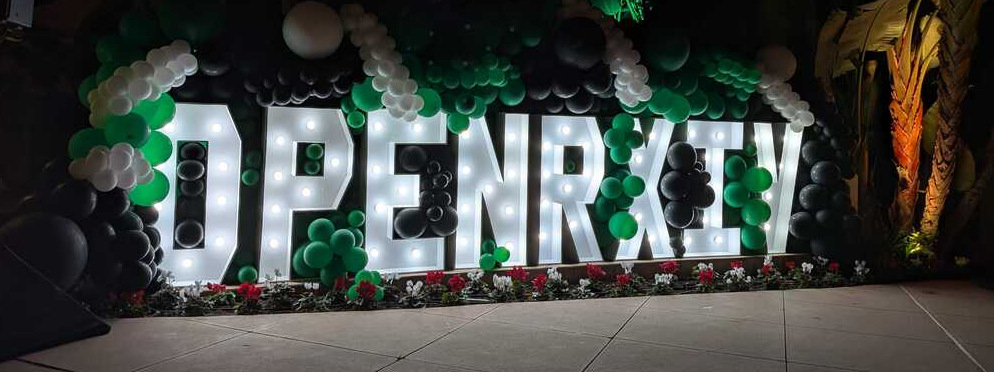

# Hot off the heels of the CZI Open Science 2025 meeting…

Hot off the heels of the **CZI Open Science 2025** meeting, the final day was dedicated entirely to the **OpenArchive community** — and in many ways, it marked the *launch* of a new era for preprints. The day was about bringing together the people and organizations that have built, maintained, and championed preprints over the past decade, while introducing the newly formalized **OpenArchive organization** and its leadership team.

## Setting the stage

The morning sessions served as both an introduction and a vision statement. **Tracy Teal**, **Richard Sever**, and **John Inglis** outlined OpenArchive’s mission and roadmap — not only to continue stewarding **bioRxiv** and **medRxiv**, but also to evolve them into a more connected, sustainable, and open ecosystem for sharing research.

Tracy walked us through the roadmap and early organizational steps: defining mission, values, and strategic direction, while also modernizing the technology stack and exploring new ways of engaging the community through *OpenArchive Labs*. That spirit of experimentation — trying new overlays, interfaces, and ways to connect data, narrative, and peer review — resonated deeply with us at Curvenote.

## The "article of the future"

A highlight of the morning was **Richard Sever's** talk on *The Article of the Future*. He painted an inspiring picture of preprints as *nodes in a constellation* — connected to datasets, protocols, reviews, and registered reports across the open science landscape.

Quoting from his 2023 *PLOS Biology* paper, Richard described a vision of "a constellation of linked web objects that include narrative and data in appropriate repositories, protocols or research plans, amid a cloud of review and evaluation elements that accumulate over time."

In this constellation, bioRxiv and medRxiv would serve as central stars, but their true power would come from their connections — linking seamlessly with data stores and providers, open APIs like **OpenAlex**, and supporting platforms for replication, verification, and peer review. They would integrate with journals like **eLife**, connect to pre-registration services such as those offered by the **Center for Open Science**, and feature trust badges that signal the strength and authenticity of these connections.

The article of the future, as Richard envisioned it, would support an open ecosystem of journals, badging services, and reviewing and commenting platforms — all built around *community preprints* and *refereed preprints* as alternatives to the siloed, publisher-first world of traditional academic publishing. 

It’s a vision we at Curvenote share deeply — a future where research communication moves beyond static PDFs toward a rich, interconnected web of open scientific objects.

## Lightning talks and community energy

After the morning plenaries came one of the most engaging parts of the day: the **lightning talks**. Eight speakers from across the OpenArchive and broader preprint ecosystem shared short, rapid-fire presentations highlighting community-led initiatives, integrations, and new ideas for improving research communication.

Among them was **Rowan Cockett**, co-founder of Curvenote, who spoke about how Curvenote’s infrastructure weaves together code, data, and narrative to create more interactive and reproducible research experiences. You can watch his full talk below:

:::{figure} ./images/openrxiv-lightning-talk-rowan-curvenote.mp4

Rowan's lightning talk on continuous and connected publishing at the OpenRXiv 2025 Meeting, in San Diego last week.
:::

Rowan’s talk offered a glimpse of how the technologies we’re building can complement OpenArchive’s efforts — creating pathways for preprints to become living, interactive documents linked directly to underlying data and analyses.

## Afternoon breakout sessions

The afternoon was devoted to breakout discussions — a chance for the community to dive deeper into pressing issues.  
One session focused on the challenges that **LLM-generated content** and paper mills pose for preprint servers, emphasizing the scale and urgency of the problem. Another explored **the future of journals** in a world where preprints are increasingly central — imagining what comes next when sharing early and open becomes the norm rather than the exception.

Across sessions, what stood out was the openness and collaboration of the community. Researchers, technologists, and publishers came together not just to discuss challenges, but to co-design the next steps for the preprint ecosystem.

## Looking forward

Overall, the OpenArchive meeting was a milestone — both a *launchpad* for a renewed organization and a *gathering* of the broader open science community.

For us at Curvenote, it reinforced the importance of infrastructure that connects the many parts of this growing constellation: data repositories, code archives, visualization tools, and now preprints themselves.

We left feeling energized and optimistic about what’s ahead. OpenArchive’s commitment to openness, interoperability, and community-driven innovation is exactly what the research ecosystem needs — and we’re proud to be part of that conversation.

---

**Links:**  
🔗 [OpenArchive website](https://openrxiv.org/)  
🔗 [Curvenote](https://www.curvenote.com)
